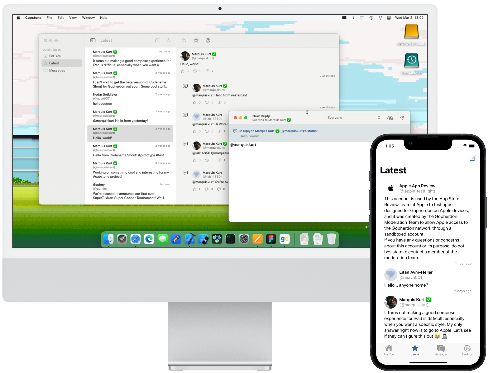

# Codename Shout (Capstone)

This repository contains source code to my capstone project, **Codename
Shout**, an experimental social media client for Gopherdon aiming to make
a more humane design to social networks.



> :warning: This project is currently in a _prototype_ state. Designs and
> features are not final and may change over the course of the project.

## Primary Objectives

This project aims to experiment with the following:

- Making social media less addictive and more conducive to discussion.
- Creating a _humane_ design by allowing more humane interactions, being
  inclusive, and being accountable in source.
- Being _frugally_ designed by being lightweight, network-efficient, and
  native with SwiftUI and other iOS/macOS technologies.
  
More information on the objectives of this project can be discovered in
the OBJECTIVES.md file, located in the root of the project's source code.

## Building from Source

**Required Tools**  
- Xcode 13 or later
- SwiftFormat

**Optional (but Recommended) Tools**  
- SwiftLint

Clone the repository via `git clone`, then open the Shout.xcodeproj file
in the root directory.

- To build for iOS/iPadOS, set the scheme to **Capstone (iOS)**.
- To build for macOS, set the scheme to **Capstone (macOS)**.

Press the Run button in the toolbar or go to **Product > Run** in the menu
bar to run the project in the iOS Simulator or your Mac. To archive the
project, change the device target to one of the following:

- For iOS/iPadOS: _Any iOS Device (arm64)_
- For macOS: _Any Mac (Apple Silicon, Intel)_

> :information_source: To prevent collisions with the normal app available
> in the App Store and/or TestFlight, it is recommended that you change
> the URL scheme from `shout://` to your own URL scheme. Change this in
> the URL Types section of each target, then change line 40 in
> Shout.swift to match:
>
> ```swift
> 37 .onAppear {
> 38    // Set the app's URL prefix to match our URL scheme. This should prevent Codename Shout from
> 39    // intercepting URLs designed to go to Hyperspace Starlight.
> 40    Chica.shared.setRequestPrefix(to: "<your-url-prefix-here>")
> 41 }
> ```

Then go to **Product > Archive** to create an archive of the app that can
be distributed through TestFlight or the App Store.

> :warning: If you plan to archive the project and submit to the App
> Store, change the bundle identifier of the project on both targets to
> the identifier you are using for your app in App Store Connect. 

## Bug Reporting

If you have found a bug or would like to make a feature request, please
file a bug report on this project's YouTrack page, which can be found at
https://youtrack.marquiskurt.net/youtrack/newIssue?project=SHU.

A link to this page will also be available in the app as soon as it in
testing phases. This will likely be located in several places throughout
the app as needed.

## Licensing

The source code for this project is licensed under Cooperative Non-Violent
License, v7+. You can read your rights in this software in LICENSE.md.

Some parts of the project are licensed under different licenses, where
applicable. You may view the terms for these licenses on their respective
projects:

- Chica: Non-Violent Public License v4+
- Cliffs image: Unsplash License (Paula Sotomayor)
