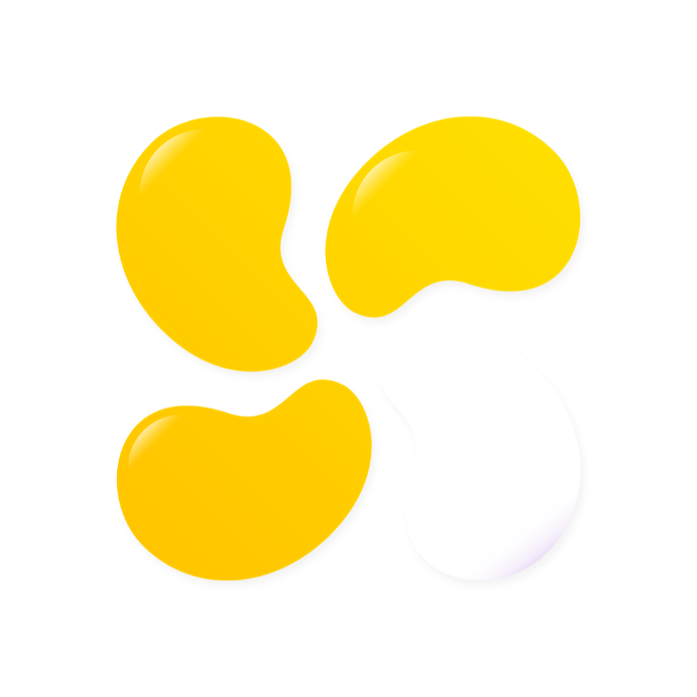

<div align="center">



# Fedigardens

</div>


**Fedigardens** is a small, personal client for the Mastodon social
network (along with any Mastodon API-compatible networks in the
fediverse). The app stems from a [capstone][capstone-link] project I
completed in college about humane social media design, and it aims to
further this concept while providing a native Apple-like app experience.

> :warning: This project is currently in a _prototype_ state. Designs and
> features are not final and may change over the course of the project.

## Primary Objectives

This project aims to experiment with the following:

- Making social media less addictive and more conducive to discussion.
- Creating a _humane_ design by allowing more humane interactions, being
  inclusive, and being accountable in source.
- Being _frugally_ designed by being lightweight, network-efficient, and
  native with SwiftUI and other iOS/macOS technologies.

## Building from Source

**Required Tools**  
- Xcode 14 or later
- SwiftFormat

**Optional (but Recommended) Tools**  
- SwiftLint

Clone the repository via `git clone`, then open the Fedigardens workspace
in the root directory.

> :information_source: To prevent collisions with the normal app available
> in the App Store and/or TestFlight, it is recommended that you change
> the URL scheme from `gardens:` to your own URL scheme. Change this in
> the URL Types section of each target, then change the corresponding line
> in Gardens.swift to match your URL prefix:
>
> ```swift
> .onAppear {
>     Alice.shared.setRequestPrefix(to: "<your-url-prefix-here>")
>     ...
> }
> ```

Press the Run button in the toolbar or go to **Product > Run** in the menu
bar to run the project in the iOS Simulator.

### Archiving the Project
To archive the project, change the device target to _Any iOS Device (arm64)_.
Then go to **Product > Archive** to create an archive of the app that can
be distributed through TestFlight or the App Store.

> :warning: If you plan to archive the project and submit to the App
> Store, change the bundle identifier of the project on both targets to
> the identifier you are using for your app in App Store Connect. 

## Bug Reporting

If you have found a bug or would like to make a feature request, please do
so on the project's Raceway page at
https://feedback.marquiskurt.net/t/fedigardens or by filing a bug report on
the GitHub repository's issues page.

## Licensing

The source code for this project is licensed under Cooperative Non-Violent
License, v7+. You can read your rights in this software in LICENSE.md.

Some parts of the project are licensed under different licenses, where
applicable. You may view the terms for these licenses on their respective
projects:

- Chica: Non-Violent Public License v4+
- SafariView: Mozilla Public License v2
- HTML2Markdown: MIT License
- Drops: MIT License
- EmojiText: Apache 2.0 License
- AckGen: MIT License
- Runestone: MIT License
- FlowKit: Mozilla Public License v2

[capstone-link]: https://github.com/alicerunsonfedora/capstone
